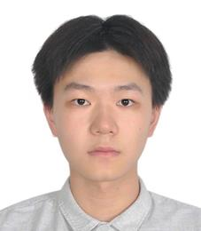

# About Me 

Hello, I am Chuangji Li (李创基), an undergraduate student in Statistics and Machine Learning at Carnegie Mellon University in Pittsburg. I am currently working with [Eason Chen](https://eason.best/) in [LearnLab](https://learnlab.org/). 

My research interests lie at machine learning and natural language processing. In particular, I am interested in improving generative models' reasoning and problem solving ability. My goal is to build the AGI. I am susceptible about the ability of large language model and working to different architecture to excel its limits. My most recent attempt was to improve model's ability to generate code, which is a crucial measure of model's reasoning ability.

Currently, I am working on math-solving models on university-level math which helps student's process of learning. 

**Contact Info**
- Emails: greatge0rgeli99@gmail.com / chuangjl@andrew.cmu.edu
- [My CV](cv.pdf)
- [Linkedin](https://www.linkedin.com/in/chuangji-li-8526a527a/)
- [Github](https://github.com/ge0rgel1)
- [Steam](https://steamcommunity.com/profiles/76561198327359459/)

## Skills
- **Math**: Multivariate Calculus, Linear Algebra, Probability and Statistics Theory, Real Analysis[ongoing], Measure Theory[ongoing]
- **Programming Languag**: C, C++, Python*, Java, Rust, R, HTML5, CSS, Javascript, MySQL. 
- **Cloud Service**: AWS, Docker
- **AI Frameworks**: PyTorch, Sklearn, Pandas, Numpy, Matplotlib
- **Machine Learning**: Linear/Logistic Regression, MLE/MAP, Dimensionality Reduction, Recommender Systems, Non-parametric Regression, Learning Theory, Ensemble, SVM, Gaussian Processes
- **Deep Learning Architectures**: CNN, RNN, Transformer, GAN, VAE, Stable Diffusion, YOLO, 

## Current Projects
- Math-solver
- Probabilistic Graphical Models
- Deep Learning System

## Past Projects
1. [project 1](project1.md)
3. [project 2](project2.md)
4. [project 3](project3.md)
5. [project 4](project4.md)

